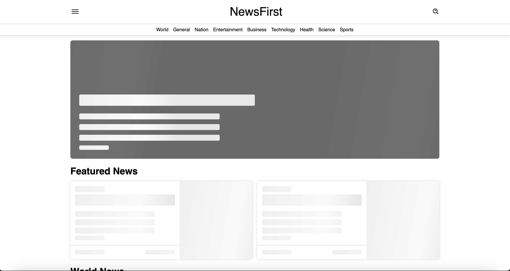
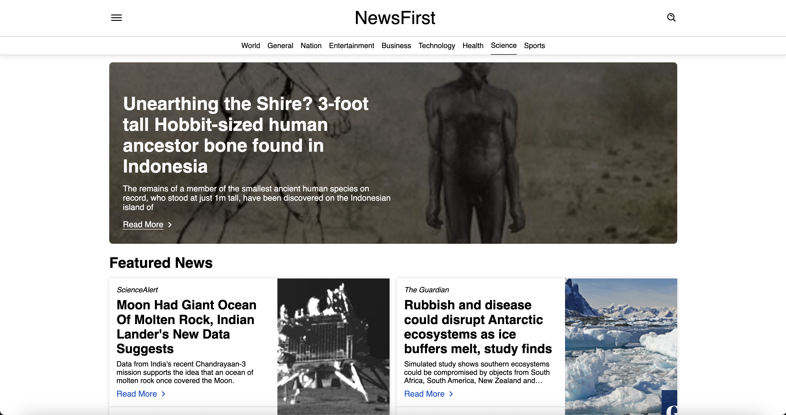
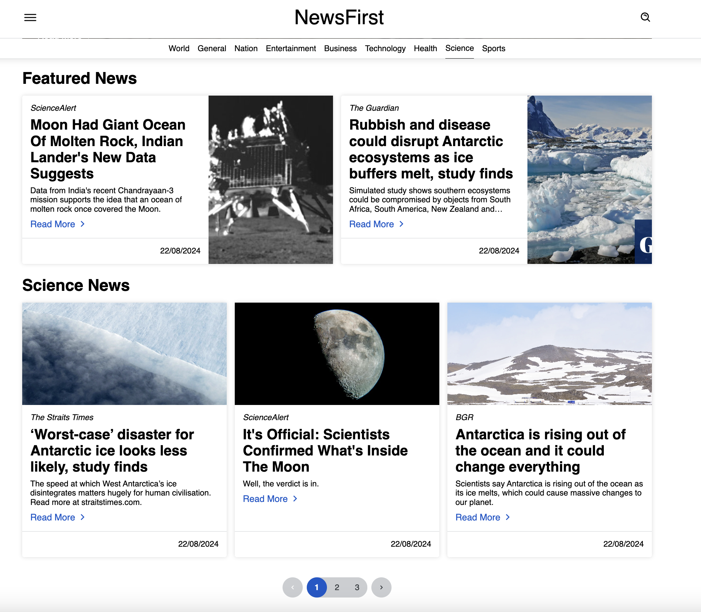
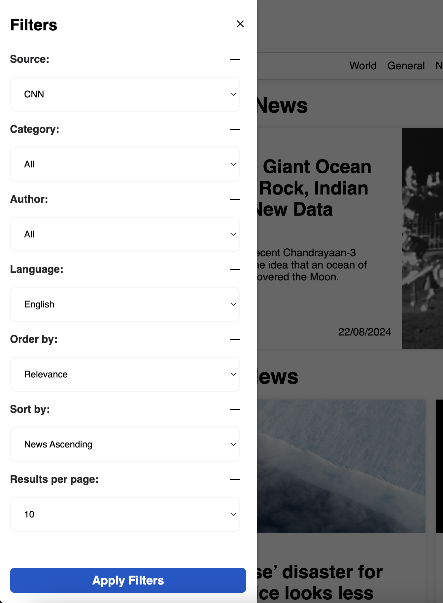
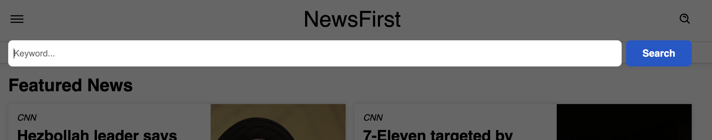
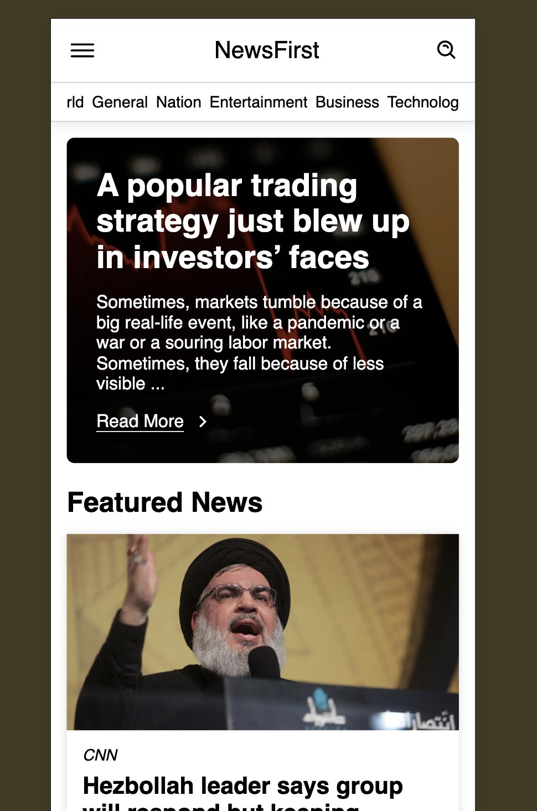

# Getting Started with News App

This project was bootstrapped with [Create React App](https://github.com/facebook/create-react-app).

## Available Scripts

In the project directory, you can run:

### `npm start`

Runs the app in the development mode.\
Open [http://localhost:3000](http://localhost:3000) to view it in your browser.

The page will reload when you make changes.\
You may also see any lint errors in the console.

Pull Docker Image [here](https://hub.docker.com/r/shalini91/news-app-shf).

Assumptions:

1. 4 API's are used - New York Times, The Guardian, GNews and NewsAPI
2. Some API's have limited usage of 100 requests per day therefore app might break if limit is exceeded. Guardian and NYT have higher usage limits. Comment others to view results of these.
3. Cannot combine some filters as per API documentation. Some filters might make an API call and others will do the filtering with existing data without an API call
4. Only the section under {search-term} news will be filtered unless an API call is made

